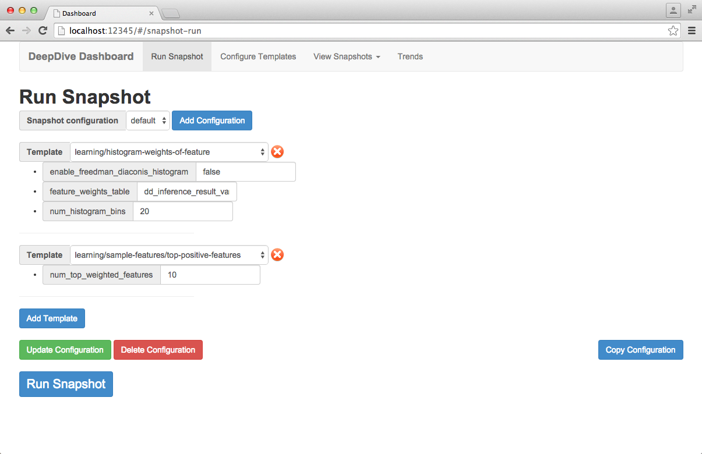
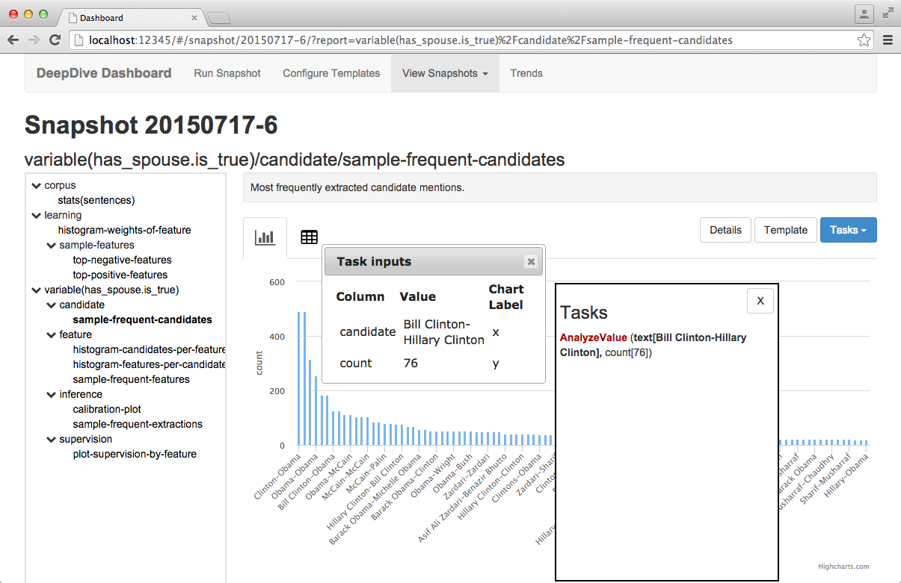
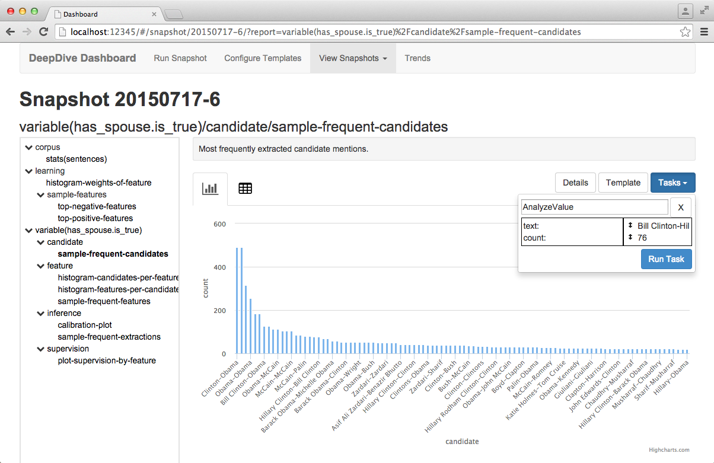
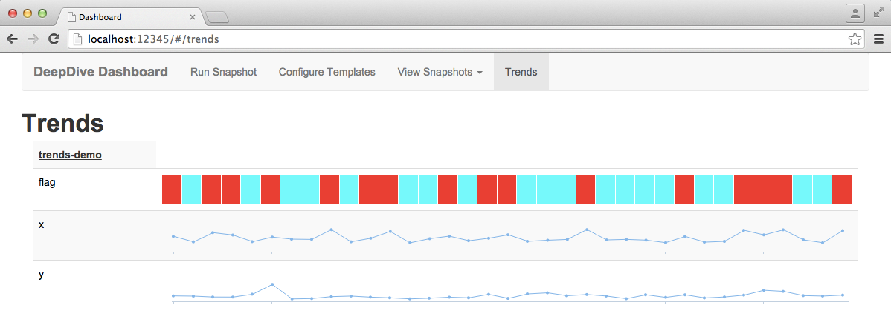
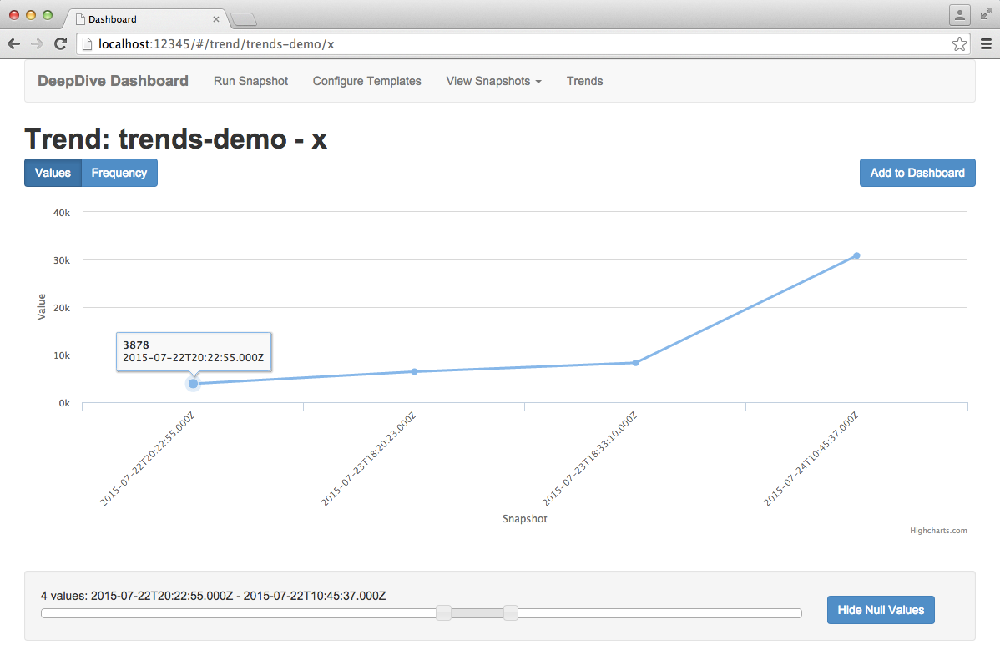
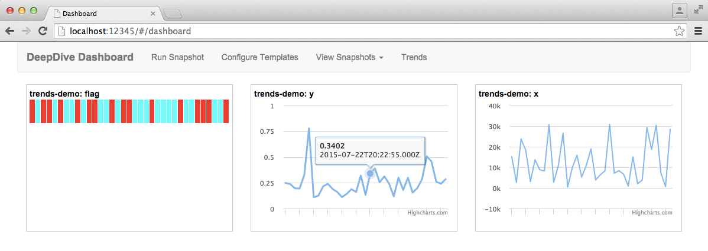

# Monitoring statistics of DeepDive data with Dashboard

*Dashboard* serves as an interface for viewing and analyzing the results of your DeepDive application runs.
It provides a structure to organize various report templates that compute app-specific metrics and snapshot of reports produced after every run.

This document is composed of two main sections.
First, we explain how to, from the [user interface](#user-interface), use Dashboards with build-in and user-specified templates, as long as defining tasks and trends.
Then, in as an [advanced topic](#advanced-topics) and for terminal lovers, we explain how to build all these reports without the user interface, which is less intuitive but fully programmable giving more flexibility.


## User Interface

In the user interface, Dashboard provides built-in [report templates](#report-templates) (as well the ability to [create your own templates](#writing-custom-templates)) which generate visual reports for the data resulting from your DeepDive application run. Reports are generated by running Dashboard [snapshots](#snapshots), which capture and retain the data relevant for displaying the reports. [Snapshot configurations](#configuring-snapshots) can be created to specify which reports should be generated for a particular Dashboard snapshot.

Once a snapshot has been run, you will be able to view the resulting reports. Additionally, you can run [tasks](#tasks) on values from a report for further analysis.

To analyze the results of your DeepDive application runs over time, you can track specified report values and view a visual representation of how they have changed over time using [Trends](#trends).

Below are two example reports based on built-in templates:


### Launching Dashboard

To bring up a GUI for the dashboard, simply run:

```bash
mindbender dashboard
```

Let's observe that running a search GUI for [browsing data](browsing.md) will also let you see the dashboard (using the dropdown menu on the top-left).

### Report Templates

Report templates, accessible from the "Configure Templates" page (in the GUI), define the data displayed in a report, as well as the appearance of the report. A number of general report templates come with Dashboard, but you may also [create your own](#writing-custom-templates).

#### Template Types

There are two types of report templates:

* Formatted: Defined by a single SQL query. This template type simply runs the SQL query on your data, and displays the results in a table on the report. Formatted templates also give the option to include charts on the report, where the X and Y axes correspond to a column name from the SQL query.
* Custom: Defined by a shell script which allows you to manipulate your data as needed. There are a number of helpful [built-in shell commands](#custom-template-commands) which you can use to perform actions such as run queries and generating custom charts.

#### Parameters

Parameters allow for the inclusion of variables in report templates which can be set at the time the snapshot is run. A common use case for parameters is when you want to run the same report template on different data sources from your DeepDive application run, or want to make a quick series of snapshots involving a varying number of data items.

The name of a parameter corresponds to the name of the variable in the report template. For example, if the parameter name is "doc\_id", the corresponding template variable is `$doc_id`.

#### Nested Templates

You may notice that the built-in report template names use slashes (`/`) to indicate a hierarchical structure. While this is a helpful strategy for organizing your report templates, the slash also has the effect of "nesting" the report template.

Nested report templates automatically inherit the parameters from their ancestor report templates, and are shown in grey on a nested report template.

More info on nested templates in the advanded [section](#extending-report-templates)

### Snapshots

A Snapshot captures all of the data required to generate the reports associated with its snapshot configuration. Prior to running a snapshot, you must specify its snapshot configuration.

#### Configuring Snapshots

A snapshot configuration consists of a list of report templates and the parameter values for each report template. Snapshot configurations are made from the "Run Snapshot" tab.

A default snapshot configuration is included with Dashboard. You may modify this configuration or create your own by clicking the "Add Configuration" button. You may also copy the contents of an existing configuration to a new configuration using the "Copy Configuration" button from an existing configuration.

To add a report template to the snapshot configuration, click the "Add Template" button and select the report template of interest from the dropdown menu. You can add additional report templates to the configuration using these same steps. If you want to remove a template from the snapshot configuration, click the red "X" next to the report template dropdown.

When a report template is selected, the corresponding parameters for that template will appear directly below. You should fill in these parameters with the values relevant to your interests and DeepDive application structure. Some parameters may already be filled in if a default value was specified in the report template. For built-in report templates, you can refer to the parameter's "Description" field for a description of what value the parameter should take.

Once you have finished adding the report templates and their corresponding parameter values which comprise the snapshot configuration, you should save the configuration by clicking the "Update Configuration" button.

A configuration can be deleted by clicking the "Delete Configuration" button from an existing configuration.



#### Running Snapshots

To run a snapshot, first load its snapshot configuration by selecting the snapshot name from the dropdown on the *Run Snapshots* page. This will show you the list of report templates and corresponding parameter values which will be used to create the snapshot.

Click the "Run Snapshot" button at the bottom of the snapshot configuration to run the snapshot.


### Viewing Reports

Once a snapshot has been made, the reports corresponding to the report templates used in the snapshot configuration will be available from the "View Snapshots" tab.

The name of the snapshot corresponds to the date the snapshot was made, followed by the run number for that day. For example, snapshot "20150714-5" was run on July 14, 2015, and was the fifth snapshot run that day.

To view the reports associated with a snapshot, click on the snapshot name. On the page for that individual snapshot, the reports are shown in a navigation menu on the left. Any nested reports are displayed hierarchically - you can use the small arrow to the left of the report names to collapse and expand the reports nested beneath it.

To view a report, click the report's name from the navigation menu. The report will display a data table or chart(s), depending on how the report template was written.

At the top right of the report are three buttons:

- Details: View the raw settings used to generate the report.
- Template: Go to the report template for this report.
- Tasks: Opens the interface for running tasks on this report. See the [tasks documentation](#tasks).


### Tasks

Tasks allow you to perform further analysis on the data displayed in a report. For example, you can display the number of mentions you extracted from a text over time.

Tasks are configured and displayed in a very similar manner as reports, with one major difference: the parameters for a task are supplied, or *bound*, by the user interactively from a report. The type of the data you are binding to a parameter must match the type specified in the task template.

Templates currently allow for 3 type specifications: int, float and string.

If no type is specified on the task template, any data value can be bound to the parameter.

#### Configuring Task Templates

Dashboard contains built-in task templates, but you can also write your own task templates.

Task templates are configured in the same way as report templates, from the "Configure Templates" page. Refer to the [documentation on writing custom templates](#writing-custom-templates) for more information.

#### Running Tasks

Tasks are run from a report page. To initiate a task, click on any data value contained in a data table or chart tooltip within a report. Doing so will display a menu of all relevant tasks which accept a parameter of the type of the data value you clicked on.

Next to each task is its corresponding list of parameters which should be supplied interactively by the user. Parameters in bold are those for which the data value selected can be bound to. To bind the data value you clicked on to a task parameter, simply click on it. The bound value will display next to the parameter. You can continue this process for any additional parameters. Parameter bindings can be un-bound by clicking the parameter you wish to remove.



At any time, you can also open the Task control interface, by clicking the "Tasks" button at the top right of the report. The Task control interface will display any currently selected task, as well as the current parameter bindings. You can edit any of the parameter bindings by cliking on them. You can also move the parameter bindings around by dragging them.

When you are ready to run the task, click "Run Task" from the task control interface. When complete, the task's output will be available from the report navigation menu directly below the report you ran the task on.



### Trends

As you run more and more snapshots, you may be interested in seeing how certain data values from your reports change over time. Trends provides a simple mechanism through which you can accomplish this.

Tracking data values can be accomplished via the `report-value` command. For example, if you wish to track a precision value from a report, and assuming the precision is stored in a `$precision` variable, simply include the following in the report template:

```bash
precision=...  # computed somehow

report-value precision="$precision"
```

Assuming the report is called "my\_report", this command will store the precision in a trend named "my\_report/precision", which is accessible from Trends.

#### Trends Overview

To view an overview of the changes in all trends for all time, visit the "Trends" page. Numeric trends will show small charts indicating the change in value over time, and non-numeric trends will display a color band, where each color uniquely identifies a categorical report value. Hovering over any of the data points will reveal an exact data value and the time of the snapshot which captured it.



#### Comprehensive Trend View

To view a trend in more detail, click on it from the Trends overview page. This page will display a larger version of the chart shown in the overview, with additional options to limit the time frame and whether to display null trend values. Limiting the time frame can be accomplished by moving either end of the slider at the bottom of the page. The number of snapshots and time range of those snapshots the view has been limited to are shown above the slider.

Toggling the Null Values button will add/remove snapshots from the chart which either did not track the trend at that point in time, or the value of the trend was `null`.

Clicking on a data point or colored band block will take you to the report in the relevant snapshot for that data value.



#### Dashboard Trends

You may want to make a few important trends easily viewable from the homepage of Dashboard for quick monitoring. To do so, click the "Add to Dashboard" button on the comprehensive trend view page to add a smaller version of the chart to the homepage of Dashboard. You can toggle this button to remove the chart from the homepage at any time.



### Writing Custom Templates

In addition to the built-in templates, you can also author your own templates.

To start a new template, click the "Add Template" button from the "Configure Templates" page. You can also click the "Copy Template" button from an existing template to create a new template with the contents of an existing template.

If you are creating a Formatted template, you simply need to ensure that the output of the template is a single SQL query.

For custom templates, you can use [markdown](https://help.github.com/articles/markdown-basics/) and shell commands to run any desired commands and provide custom output for the report. To make authoring custom templates easier, we have included a number of built-in shell commands, which are described in the [Custom Template Commands](#custom-template-commands) section below.

You will also need to specify whether the template is for a Report or Task. If you are creating a Task template, you additionally need to specify the *scope* of the template, which is the report (or set of reports if selecting a hierarchical report name) that the task is valid for.


## Advanced Topics

Here we explore the details of Dashboard, in particular how to write specific commands and scripts such that many built-in and user-defined reports can be run automatically.

More info can be found on the [Mindbender repo](https://github.com/HazyResearch/mindbender/tree/master/dashboard#readme).

### DeepDive Snapshots

After each run of a DeepDive app, you can run

```bash
mindbender snapshot
```

This command is used to produce a *snapshot* under `snapshot/` of the target app with a unique name beginning with a timestamp, e.g., `snapshot/20150206-1/`.

* **Reports**.
  Each snapshot will contain a set of reports that summarize various aspects about the data products of the DeepDive run or the code that produced them.
    * The set of reports to be produced are controlled by a *snapshot configuration* (described in the next section).
    * `reports/` directory contains all the individually produced reports.
    * `README.md` merges those of the individual reports.
    * `reports.json` aggregates all the important values reported by individual reports in a machine-friendlier JSON format.

* **Files**.
  Alongside the reports, copies of important DeepDive artifacts, such as the `application.conf` and extractor code are automatically preserved for future reference under the `files/` directory.
    * The list of files to keep can be enumerated in `snapshot-files` next to the `snapshot/` directory.


### Dashboard Snapshot Configuration

The list of reports each new snapshot produces should be configured in a *snapshot configuration*.

* A dashboard snapshot configuration is a plain text file named `snapshot-*.conf` that resides at the root of the DeepDive app.
* Any text after a `#` character is ignored, so comments can be written there.
* Each of its line begins with either:
    * `section`, followed by a section title, or
    * `report`, followed by a name referring to a *report template* (described in the next section), and zero or more named parameters separated by white space.
* Each time a new snapshot is created, a copy of this snapshot configuration will be retained in the snapshot.

Here's an example snapshot configuration that produces four reports.

```bash
#### dashboard snapshot configuration

# show statistics about the corpus stored in table "sentences"
report corpus   table=sentences column_document=doc_id column_sentence=sent_id

section "Variables"
report variable/inference    variable=has_spouse.is_correct
report variable/supervision  variable=has_spouse.is_correct top_positive=10 top_negative=10
report variable/feature      variable=has_spouse.is_correct
report variable/candidate    variable=has_spouse.is_correct
```

### Report Template

Each report in a snapshot is produced by a *report template*.

* **Structure**:
  a report template is a carefully structured directory on the file system.
    * It resides under either:
        * `snapshot-template/` of the target DeepDive app (app-specific), or
        * `dashboard/snapshot-template/` of Mindbender's source tree (built-in).
    * It is referred from the snapshot configuration with the path name relative to `snapshot-template/`.
    * It must contain one or more of the following:
        * An executable file named `report.sh`.
        * An executable document `README.md.in`.
        * One or more *nested report templates* (described later).
    * It may contain as many extra files as it needs.
        * All files in the template will be cloned to the report instance.
        * Any file named `*.in` will be considered as executable documents and automatically compiled at production time.
* **Parameters**:
  it takes zero or more named parameters (i.e., `name=value` pairs).
    * The parameters should be declared in the `report.params` file.
    * Each `report` line in the snapshot configuration provides value bindings for these parameters.
    * This allows a template to be instantiated with different sets of parameters to produce multiple reports.
    * The `report.params` file must be formatted in the following way:
        * Each line declares a parameter,
            * whose name may contain only alphanumeric letters and underscore (`_`) and must begin with an alphabet or underscore.
        * A required parameter is declared by a line beginning with `required`, followed by
            * the parameter name, and
            * a description surrounded by quotes.
        * An optional parameter is declared by a line beginning with `optional`, followed by
            * the parameter name,
            * the default value surrounded by quotes, and
            * a description surrounded by quotes.
* **Executables**:
  a report template must contain at least one executable that produces its contents.

    * A `report.sh` shell script can invoke as many other programs as it needs to produce various output files in the report as well as the `README.md` and `report.json`.
        * Several utilities are provided to simplify the common tasks from writing valid JSON to querying data in the underlying database of the DeepDive app.

    * An executable document, named `*.in`, is a text file mixed with shell scripts.
        * Shell script fragments must be surrounded by `<$` and `$>`, e.g.,

            ```
            There are <$ deepdive sql "SELECT COUNT(DISTINCT doc_id) FROM sentences" $> documents in the corpus.
            ```

        * After executing every mixed in shell script in the order they appear, their output will be interpolated with the normal text, and written to a file named without the trailing `.in`, e.g., `README.md.in` will produce a `README.md` after execution.

        * Keeping the reporting logic in executable documents may be simpler than `report.sh` if it mainly computes values to be presented in between a chunk of text, e.g., as for `README.md`.

        * It can be viewed as an inverted shell script, where normal text is written to the output in between running the fragments of shell scripts.


#### How Each Report Is Produced

Suppose a line in the snapshot configuration refers to report template `variable/inference` with a named parameter `variable=has_spouse.is_correct`.
Following steps are taken to produce the report.

1. **Instantiation**.
   A *report instance* (or simply *report*) directory is created under `reports/` of the snapshot, e.g., `reports/variable/inference/`.
    * If the same report template is instantiated more than once (most likely with different parameters), the path of the report will be suffixed with a unique serial number, to isolate each report instance from others, e.g., `reports/variable/inference-2/`, `reports/variable/inference-3/`, etc.
    * All files in the template directory for `variable/inference` are cloned into the report instance, preserving the structure within the template.
2. **Parameters**.
   All parameters given by the snapshot configuration are checked against the `report.params` specification
    * If there are `report.params` in the parent directories of the report template, parameters declared in them will also be checked.
      For example, `variable/report.params` as well as `variable/inference/report.params` will be used.
    * Finally, all parameter values are recorded in `report.params.json` in JSON format as well as `.report.params.sh` in a shell script.
3. **Execution**.
   All `report.sh` scripts and executable documents (`*.in`) in the report are executed under a controlled environment:
    * All named parameters for the report are declared as environment variables.
    * Current working directory is set to the report directory.
    This localizes file accesses with the scripts and executable documents, and therefore simplifies reading files in the template as well as generating new ones without having to refer to any global path or variables.


#### What Each Report Contains After Production

* `README.md` -- a human-readable content of the report in Markdown syntax is expected to be produced.
* `report.json` -- a machine-readable content of the report in JSON format may be produced as well to easily keep track of important values.
* `report.params.json` -- a machine-readable file that records all parameters used for producing the report in JSON format.
    * `.report.params.sh` -- all parameter bindings stored in a shell script, so it can be easily loaded.
    * `.report.params.*` -- other by-products of checking parameters.
* `.report.id` -- a unique identifier (within a snapshot) for the report is generated and stored in this file.
* `*` -- rest of the files are either cloned from the report template, or generated by an executable in the report.


#### Extending Report Templates

Report templates are carefully designed to be easily extensible.
Because it is often necessary to augment part of an existing report with app-specific metrics or sample data, the *nested report template* design tries to enable this with minimal user effort, avoiding repetition of existing report templates as much as possible.

* **Nested Report Templates**.
  A report template may be nested under another template.
  When instantiating the parent template from the snapshot configuration,
    * All nested ones will be instantiated with the same set of parameters.
      All `report.params` specifications found along the path to each nested one will be used to check and supply default values for the parameters.
    * App-specific as well as built-in nested templates will all be instantiated.
      Therefore, a built-in report template can be easily extended from a DeepDive app by adding app-specific nested templates.
      For example, `variable/new-metric` in the app extends the built-in `variable` template.

* **Ordering Nested Templates**.
  The instantiation order of the nested templates can be specified in a special file named `reports.order`.
    * Each line of the file should contain a glob pattern matching nested report templates under it.
    * At most one of the line may be wildcard `*`, which denotes the position for the rest of the paths not explicitly mentioned.
    * For example, `variable/reports.order` has the following lines, which orders the summary at the top and the built-in templates in a particular order at the bottom, so any app-specific ones appear first:

        ```
        summary
        *
        quality
        inference
        supervision
        feature
        candidate
        ```

    * Currently, there's a limitation that nested `reports.order` have no effect, and only the one at the top of the template directly mentioned from the snapshot configuration is taken into account.


For example, consider the "Variables" section of the previous snapshot configuration:

```bash
#### dashboard snapshot configuration (instantiating each template individually)
section "Variables"
report variable/inference    variable=has_spouse.is_correct
report variable/supervision  variable=has_spouse.is_correct top_positive=10 top_negative=10
report variable/feature      variable=has_spouse.is_correct
report variable/candidate    variable=has_spouse.is_correct
```

This could be rewritten as a single line as shown below:

```bash
#### dashboard snapshot configuration (instantiating group of nested templates)
section "Variables"
report variable              variable=has_spouse.is_correct top_positive=10 top_negative=10
```

Furthermore, when more templates are added to `variable`, they will also get produced automatically without adding numerous lines for every instantiation of `variable` in the snapshot configuration.


### Utilities for Report Templates

Several utilities are provided to the executables in report templates to simplify the writing of new report templates.

#### For producing JSON
`report-values` command can be used for augmenting named values to the `report.json` file without dealing with JSON parsing and formatting.
For example, suppose `report.json` already had the following content:

```json
{
  "a": "foo",
  "b": "bar"
}
```

Simply running the command below will update `report.json` to have what follows:

```bash
report-values x=1 y=2.34 b=true c=bar d='[1,"2","three"]'
```

```json
{
  "a": "foo",
  "b": true,
  "x": 1,
  "y": 2.34,
  "c": "bar",
  "d": [
    1,
    "2",
    "three"
  ]
}
```

As shown in this example, values passed as arguments can be a valid JSON formatted string, or they will be treated as a normal string.


#### Running SQL queries
`deepdive sql` command runs a SQL query against the underlying database for the current DeepDive app, and outputs the result in tab-separated format.


#### Including CSV/TSV data in HTML or Markdown
`html-table-for` command formats a given CSV or TSV file into an HTML table that can be included in Markdown documents.
For example, the following executable document runs a SQL query to retrieve 10 sample candidates and presents a table.
Note the extra `CSV HEADER` arguments to `deepdive sql` for producing a CSV format compatible with this command.

```markdown
<!-- README.md.in -->

##### 10 Most Frequent Candidates
Here are the 10 most frequent candidates extracted by DeepDive:
<$
deepdive sql "
    SELECT words, COUNT(*) AS count
    FROM candidate_table
    GROUP BY words
    ORDER BY count DESC
    LIMIT 10
" format=csv header=1 >top_candidates.csv

html-table-for top_candidates.csv
$>
```

It will produce a table that looks like the following:
<blockquote>
<h4>10 Most Frequent Candidates</h4>
Here are the 10 most frequent candidates extracted by DeepDive:
<table>
    <thead><tr><th>words</th><th>count</th></tr></thead>
    <tbody>
        <tr><td>foo</td><td>987</td></tr>
        <tr><td>bar</td><td>654</td></tr>
        <tr><td>...</td><td>...</td></tr>
    </tbody>
</table>
</blockquote>


#### Logging messages
`report-log` and `report-warn` commands shows given arguments as timestamped messages in the log.
`report-warn` will start the message with a `WARNING:` sign to make it stand out.

The following command will print the next two lines below:

```bash
report-log "Computing something..."
report-warn "Something went wrong!"
```

```
2015-02-21 06:28:12 localhost   Computing something...
2015-02-21 06:28:13 localhost   WARNING: Something went wrong!
```

#### Displaying charts

The `<chart>` tag can be used to display a chart (rendered using [Highcharts](http://www.highcharts.com/))  within a custom report template. The attribute values for the `<chart>` tag are outlined below:

```html
<chart
        highcharts-options="{}"  # Optional highcharts configurations
        data-file="FILE"         # JSON data file from which to render the chart
        data="JSON DATA"         # Raw JSON data from which to render the chart
        type="bar|scatter"       # The type of the chart
        x-axis="X_AXIS_NAME"     # The name of the column from the JSON file to use for the X axis
        x-label="X_AXIS_LABEL"   # Text label for the X axis
        y-axis="Y_AXIS_NAME"     # The name of the column from the JSON file to use for the Y axis
        y-label="Y_AXIS_LABEL"   # Text label for the Y axis
></chart>
```

Either the `data-file` or `data` attribute must be specified, but not both. The format of the JSON data can be in either row-major or column-major order, e.g.:

* Row-major order

    ```json
    {
      "headers": [
        "num_candidates",
        "num_features"
      ],
      "data": [
        [
          1,
          3
        ],
        [
          2,
          5
        ],
        [
          3,
          10
        ],
        [
          4,
          54
        ]
      ]
    }
    ```

* Column-major order

    ```json
    {
      "num_candidates": [
        1,
        2,
        3,
        4
      ],
      "num_features": [
        3,
        5,
        10,
        54
      ]
    }
    ```

An example use of the `<chart>` tag is given below:

```html
<chart
        highcharts-options="{ chart: { width: 500, height: 400 }, title: { text: 'Candidates vs. Features' } }"
        data-file="candidates_features_data"
        type="scatter"
        x-axis="num_candidates"
        x-label="Number of Candidates"
        y-axis="num_features"
        y-label="Number of Features"
></chart>
```
