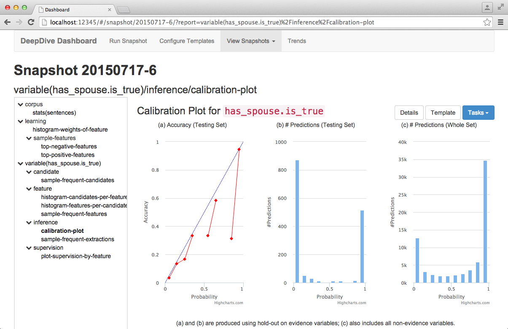
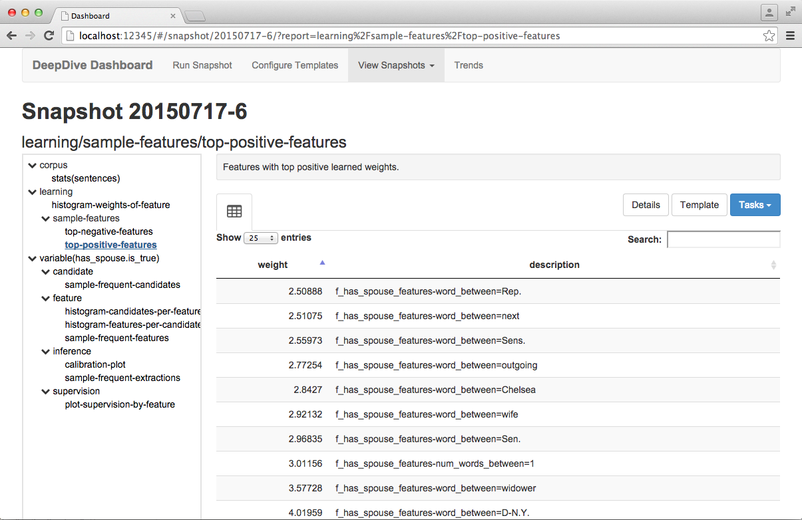
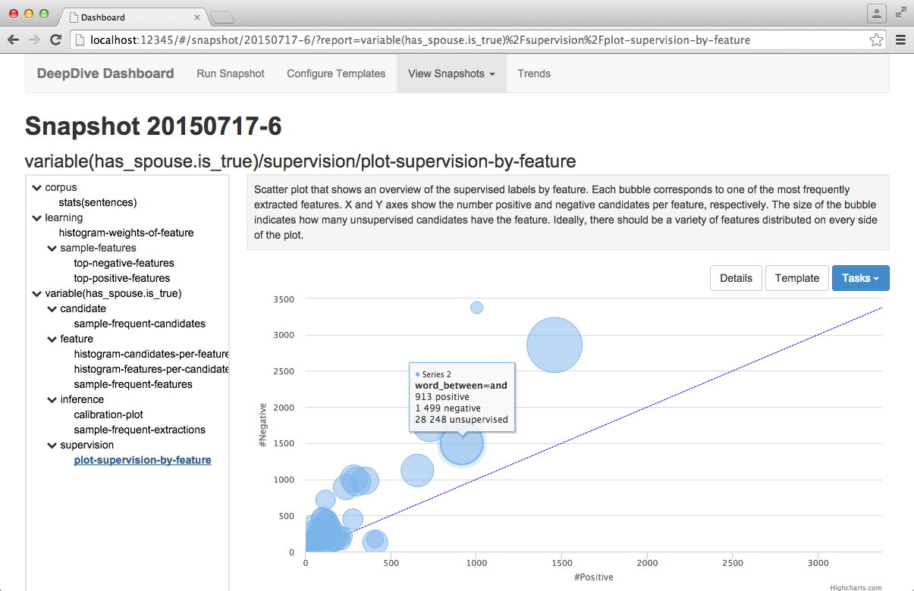

# Dashboard

This document describes Dashboard, which serves as an interface for viewing and analyzing the results of your DeepDive application runs.

Dashboard provides built-in [report templates](#report-templates) (as well the ability to [create your own templates](#writing-custom-templates)) which generate visual reports for the data resulting from your DeepDive application run. Reports are generated by running Dashboard [snapshots](#snapshots), which capture and retain the data relevant for displaying the reports. [Snapshot configurations](#configuring-snapshots) can be created to specify which reports should be generated for a particular Dashboard snapshot. 

Once a snapshot has been run, you will be able to view the resulting reports. Additionally, you can run [tasks](#tasks) on values from a report for further analysis.

To analyze the results of your DeepDive application runs over time, you can track specified report values and view a visual representation of how they have changed over time using [Trends](#trends).

Below are two example reports based on built-in templates:




## Launching Dashboard

[Jaeho]

## Report Templates

Report templates, accessible from the "Configure Templates" page, define the data displayed in a report, as well as the appearance of the report. A number of general report templates come with Dashboard, but you may also [create your own](#writing-custom-templates).

### Template Types

There are two types of report templates: 

* Formatted: Defined by a single SQL query. This template type simply runs the SQL query on your data, and displays the results in a table on the report. Formatted templates also give the option to include charts on the report, where the X and Y axes correspond to a column name from the SQL query.
* Custom: Defined by a shell script which allows you to manipulate your data as needed. There are a number of helpful [built-in shell commands](#custom-template-commands) which you can use to perform actions such as run queries and generating custom charts.

### Parameters

Parameters allow for the inclusion of variables in report templates which can be set at the time the snapshot is run. A common use case for parameters is when you want to run the same report template on different data sources from your DeepDive application run, or want to make a quick series of snapshots involving a varying number of data items.

The name of a parameter corresponds to the name of the variable in the report template. For example, if the parameter name is "doc_id", the corresponding template variable is ```$doc_id```.

### Nested Templates

You may notice that the built-in report template names use slashes (```/```) to indicate a hierarchical structure. While this is a helpful strategy for organizing your report templates, the slash also has the effect of "nesting" the report template.

Nested report templates automatically inherit the parameters from their ancestor report templates, and are shown in grey on a nested report template. 


## Snapshots

A Snapshot captures all of the data required to generate the reports associated with its snapshot configuration. Prior to running a snapshot, you must specify its snapshot configuration.

### Configuring Snapshots

A snapshot configuration consists of a list of report templates and the parameter values for each report template. Snapshot configurations are made from the "Run Snapshot" tab.

A default snapshot configuration is included with Dashbaord. You may modify this configuration or create your own by clicking the "Add Configuration" button. You may also copy the contents of an existing configuration to a new configuration using the "Copy Configuration" button from an existing configuration.

To add a report template to the snapshot configuration, click the "Add Template" button and select the report template of interest from the dropdown menu. You can add additional report templates to the configuration using these same steps. If you want to remove a template from the snapshot configuration, click the red "X" next to the report template dropdown.

When a report template is selected, the corresponding parameters for that template will appear directly below. You should fill in these parameters with the values relevant to your interests and DeepDive application structure. Some parameters may already be filled in if a default value was specified in the report template. For built-in report templates, you can refer to the parameter's "Description" field for a description of what value the parameter should take.

Once you have finished adding the report templates and their corresponding parameter values which comprise the snapshot configuration, you should save the configuration by clicking the "Update Configuration" button.

A configuration can be deleted by clicking the "Delete Configuration" button from an existing configuration.


### Running Snapshots

To run a snapshot, first load its snapshot configuration by selecting the snapshot name from the dropdown on the *Run Snapshots* page. This will show you the list of report templates and corresponding parameter values which will be used to create the snapshot.

Click the "Run Snapshot" button at the bottom of the snapshot configuration to run the snapshot.


## Viewing Reports

Once a snapshot has been made, the reports corresponding to the report templates used in the snapshot configuration will be available from the "View Snapshots" tab.

The name of the snapshot corresponds to the date the snapshot was made, followed by the run number for that day. For example, snapshot "20150714-5" was run on July 14, 2015, and was the fifth snapshot run that day.

To view the reports associated with a snapshot, click on the snapshot name. On the page for that individual snapshot, the reports are shown in a navigation menu on the left. Any nested reports are displayed hierarchically - you can use the small arrow to the left of the report names to collapse and expand the reports nested beneath it. 

To view a report, click the report's name from the navigation menu. The report will display a data table or chart(s), depending on how the report template was written.

At the top right of the report are three buttons:
* Details: View the raw settings used to generate the report.
* Template: Go to the report template for this report.
* Tasks: Opens the interface for running tasks on this report. See the [tasks documentation](#tasks).



## Tasks

Tasks allow you to perform further analysis on the data displayed in a report. For example, [Jaeho - common use case for tasks].

Tasks are configured and displayed in a very similar manner as reports, with one major difference: the parameters for a task are supplied, or *bound*, by the user interactively from a report. The type of the data you are binding to a parameter must match the type specified in the task template.

Templates currently allow for 3 type specifications:
* int
* float
* string

If no type is specified on the task template, any data value can be bound to the parameter.

### Configuring Task Templates

Dashboard contains built-in task templates, but you may also write your own task templates. 

Task templates are configured in the same way as report templates, from the "Configure Templates" page. Refer to the [documentation on writing custom templates](#writing-custom-templates) for more information.

### Running Tasks

Tasks are run from a report page. To initiate a task, click on any data value contained in a data table or chart tooltip within a report. Doing so will display a menu of all relevant tasks which accept a parameter of the type of the data value you clicked on.

Next to each task is its corresponding list of parameters which should be supplied interactively by the user. Parameters in bold are those for which the data value selected can be bound to. To bind the data value you clicked on to a task parameter, simply click on it. The bound value will display next to the parameter. You can continue this process for any additional parameters. Parameter bindings can be un-bound by clicking the parameter you wish to remove.


At any time, you can also open the Task control interface, by clicking the "Tasks" button at the top right of the report. The Task control interface will display any currently selected task, as well as the current parameter bindings. You can edit any of the parameter bindings by cliking on them. You can also move the parameter bindings around by dragging them.

When you are ready to run the task, click "Run Task" from the task control interface. When complete, the task's output will be available from the report navigation menu directly below the report you ran the task on.


## Trends

As you run more and more snapshots, you may be interested in seeing how certain data values from your reports change over time. Trends provides a simple mechanism through which you can accomplish this.

Tracking data values can be accomplished via the ```report-value command```. For example, if you wish to track a precision value from a report, and assuming the precision is stored in a ```$precision``` variable, simply include the following in the report template:

```report-value precision, $precision``` [Jaeho]

Assuming the report is called "my_report", this command will store the precision in a trend named "my_report/precision", which is accessible from Trends.

### Trends Overview

To view an overview of the changes in all trends for all time, visit the "Trends" page. Numeric trends will show small charts indicating the change in value over time, and non-numeric trends will display a color band, where each color uniquely identifies a categorical report value. Hovering over any of the data points will reveal an exact data value and the time of the snapshot which captured it.


### Comprehensive Trend View

To view a trend in more detail, click on it from the Trends overview page. This page will display a larger version of the chart shown in the overview, with additional options to limit the time frame and whether to display null trend values. Limiting the time frame can be accomplished by moving either end of the slider at the bottom of the page. The number of snapshots and time range of those snapshots the view has been limited to are shown above the slider.

Toggling the Null Values button will add/remove snapshots from the chart which either did not track the trend at that point in time, or the value of the trend was ```null```.

Clicking on a data point or colored band block will take you to the report in the relevant snapshot for that data value.


### Dashboard Trends

You may want to make a few important trends easily viewable from the homepage of Dashboard for quick monitoring. To do so, click the "Add to Dashboard" button on the comprehensive trend view page to add a smaller version of the chart to the homepage of Dashboard. You can toggle this button to remove the chart from the homepage at any time.


## Advanced Topics

### Writing Custom Templates

In addition to the built-in templates, you can also author your own templates. 

To start a new template, click the "Add Template" button from the "Configure Templates" page. You can also click the "Copy Template" button from an existing template to create a new template with the contents of an existing template. 

If you are creating a Formatted template, you simply need to ensure that the output of the template is a single SQL query.

For custom templates, you can use [markdown](https://help.github.com/articles/markdown-basics/) and shell commands to run any desired commands and provide custom output for the report. To make authoring custom templates easier, we have included a number of built-in shell commands, which are described in the [Custom Template Commands](#custom-template-commands) section below.

You will also need to specify whether the template is for a Report or Task. If you are creating a Task template, you additionally need to specify the *scope* of the template, which is the report (or set of reports if selecting a hierarchical report name) that the task is valid for.

#### Custom Template Commands
[Jaeho]
* run-sql: Runs a SQL query. Example: ```run-sql "SELECT * FROM table"```
* report-value
* ...

### Under the Hood

#### Command Line
[Jaeho]
* dashboard command
* snapshot command

#### File System Layout
[Jaeho]
Running snapshots will create a ```snapshot``` directory in your DeepDive application, which contains a directory for each snapshot, containing all of the data used to display that snapshot. 

At the top level of a snapshot directory, there are a few configuration files, including ```reports.json``` which is a JSON object of all the reports and parameters used to generate the snapshot. 

The actual data from each snapshot is in a ```reports``` directory, which contains a directory for each report run. If a report is generated from a [nested template](#nested-templates), its directory will be nested under the ancestor report directory. The contents of a report directory will vary based on whether the report is Formatted or Custom:

##### Formatted Report Directory

The key files in this directory are:
* data.sql: The SQL query which defines the Formatted report template. 
* data.json: A JSON representation of the result of the template's SQL query.
* report.params.json: A JSON representation of the parameters used to generate the report, including any inherited parameters from ancestor templates.
* report.params: A JSON representation of the parameters used to generate the report, excluding any inherited parameters from ancestor templates.
* report.desc: The description of the report.

##### Custom Report Directory

This directory will contain any data files which were created within the shell script defining the custom report template. Additionally, there are a few standard files:
* README.md.in: The custom report template definition.
* README.md: The result of processing README.md.in. This is what is displayed on the actual custom report. 
* report.params.json: A JSON representation of the parameters used to generate the report, including any inherited parameters from ancestor templates.
