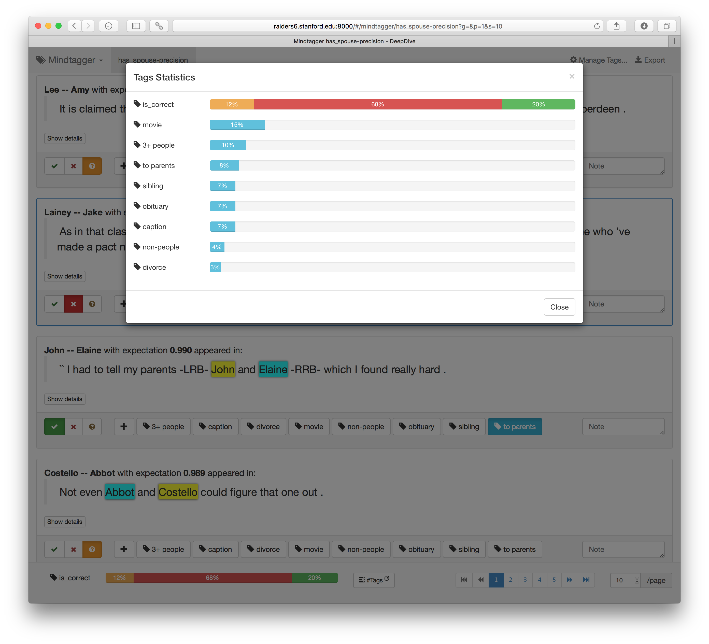
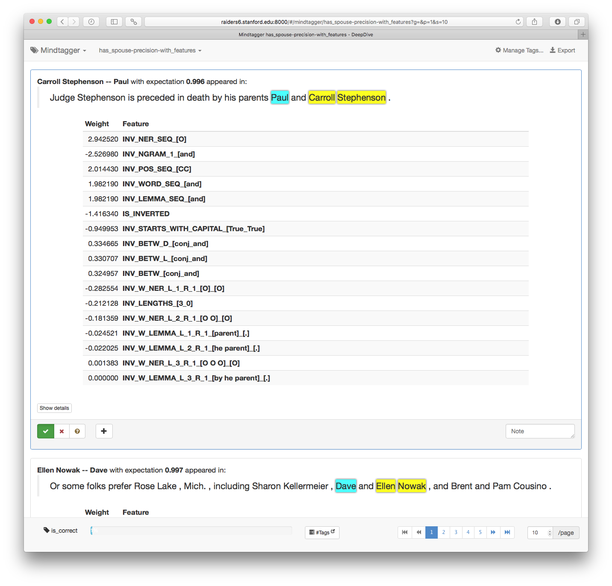

# Labeling DeepDive data with Mindtagger

This document describes a common data labeling task one has to perform while developing DeepDive applications, and introduces a graphical user interface tool dedicated for accelerating such tasks.
We use the expressions annotating, marking, and tagging data interchangeably with labeling the data.

To assess the performance of the DeepDive application, one typically measures the quality of its data products by computing the precision and recall.
Let's define some terms before we move on.
The *relevant* set is the exact set of information, e.g., entities or relationships, one wants to extract, while DeepDive's *positive* prediction is the set of information extracted by DeepDive whose assigned expectation value is greater than a certain threshold.
*Precision* is the ratio of the relevant ones in DeepDive's positive predictions.
Precision is 1 if DeepDive made no mistake in its predictions by assigning high expectation only to the relevant ones (no false positives).
As DeepDive assigns high expectation to more number of irrelevant ones, precision decreases.
On the other hand, *recall* is the ratio of DeepDive's positive predictions in all relevant ones.
Recall is 1 if DeepDive did not miss any relevant ones (no false negatives).
Recall decreases as DeepDive either assigns low expectation to more number of relevant ones or drops more of them during the candidate extraction steps.

Because the relevant set of a corpus is usually not known in advance, humans have to inspect a sample of DeepDive's predictions as well as the corpus, and answer whether each of them is relevant or not, to estimate the true values of such measures.
Estimating the precision can be as simple as randomly sampling predictions with expectation higher than a threshold, then counting how many were relevant.
However, estimating the recall accurately can be very costly as one needs to find enough number of relevant information sampled from the entire corpus.
In this document, we show how the task of precision estimation for a DeepDive application can be done in a systematic and convenient way using a graphical user interface.


## Mindtagger: A Tool for Labeling Data

*[Mindtagger][]* is a general data annotation tool that provides a customizable interactive graphical user interface.
For an annotation task it takes as input a list of items with a template that defines how each item should be rendered and what annotations can be added.
Mindtagger provides an interactive interface for humans to look at the rendered items and quickly go through each of them to leave annotations.
The annotations collected over time can then be output in various forms (SQL, CSV/TSV, and JSON) to be used outside of the tool, such as augmenting the ground truth of a DeepDive application.
Note that Mindtagger currently does not help the sampling part but only supports the labeling task of the precision/recall estimation.
Therefore, producing the right sample for correct estimation is Mindtagger user's responsibility.


## Use Case 1: Measuring Precision of the Spouse Example

In the following few steps, we explain how Mindtagger can help you perform a precision estimation task using the [spouse example in our tutorial](example-spouse.md).
All commands and path names used in the rest of this section will assume we are looking at the [code under `examples/spouse/`](../examples/spouse/).

```bash
cd examples/spouse/
```

### 1.1. Prepare the data items to inspect

First, you need to grab a reasonable number of samples for the precision task.
Using the SQL query shown below, you can get a hundred positive predictions (with threshold 0.9) of `has_spouse` relationship along with the array of words of the sentence the relationship was mentioned as well as two text spans mentioning the two persons involved.

```sql
-- labeling/has_spouse-precision/sample-has_spouse.sql file


```

Let's keep the result of the SQL query in a file named `has_spouse.csv`.

```bash
deepdive sql <"labeling/has_spouse-precision/sample-has_spouse.sql" >"has_spouse.csv"
```

The lines in the [generated `has_spouse.csv`](../examples/spouse/labeling/has_spouse-precision/has_spouse.csv) should look similar to the following:

```
p1_id,p2_id,doc_id,sentence_index,label,expectation,tokens,p1_text,p1_start,p1_end,p2_text,p2_start,p2_end
b5d4091a-4fb0-4afb-8d49-65e985f1be21_65_13_13,b5d4091a-4fb0-4afb-8d49-65e985f1be21_65_11_11,b5d4091a-4fb0-4afb-8d49-65e985f1be21,65,,0.994,"{Danny,was,on,the,ground,in,a,pickup,truck,"","",while,Mickey,and,Stan,flew,above,"","",issuing,instructions,on,where,to,change,the,co,se,.}",Stan,13,13,Mickey,11,11
248c8a3a-ea00-454d-b018-968e410c190f_41_16_16,248c8a3a-ea00-454d-b018-968e410c190f_41_18_18,248c8a3a-ea00-454d-b018-968e410c190f,41,,0.98,"{``,While,I,'m,as,entertained,as,anyone,by,this,personal,back-and-forth,about,the,history,of,Donald,and,Carly,'s,career,"","",'',he,said,"","",``,for,the,55-year-old,construction,worker,out,in,that,audience,tonight,who,does,n't,have,a,job,"","",who,ca,n't,fund,his,child,'s,education,--,I,got,ta,tell,you,the,truth,--,they,could,care,less,about,your,career,'',___,FIGHTING,FOR,ATTENTION,ON,A,CROWDED,STAGE,With,a,record,number,of,debate,participants,"","",they,could,n't,all,stand,out,.}",Donald,16,16,Carly,18,18
bdff3acf-88a1-473a-b3d7-542ec6cf20a1_66_9_9,bdff3acf-88a1-473a-b3d7-542ec6cf20a1_66_7_7,bdff3acf-88a1-473a-b3d7-542ec6cf20a1,66,,0.996,"{Lucy,and,Simon,do,deliver,Chloé,to,Thomas,and,Pierre,"","",but,they,say,there,is,one,more,returned,person,they,want,.}",Pierre,9,9,Thomas,7,7
8fe3c398-184d-4c31-b8ce-31bde7445d87_2_17_20,8fe3c398-184d-4c31-b8ce-31bde7445d87_2_13_15,8fe3c398-184d-4c31-b8ce-31bde7445d87,2,,0.995,"{She,was,born,October,2,"","",1963,in,West,Helena,"","",Arkansas,to,Arvey,Lee,Turner,and,Dorothy,Ann,Taylor,Turner,.}",Dorothy Ann Taylor Turner,17,20,Arvey Lee Turner,13,15
fd868d84-0c8b-4f60-8050-77013669a6d5_18_4_5,fd868d84-0c8b-4f60-8050-77013669a6d5_18_1_2,fd868d84-0c8b-4f60-8050-77013669a6d5,18,,1,"{05,Randeep,Hooda,and,Lisa,Haydon,:,Soon,after,the,release,of,her,successful,film,Queen,"","",model-turned-actor,Lisa,Haydon,and,actor,Randeep,Hooda,were,snapped,in,Mumbai,late,in,the,night,.}",Lisa Haydon,4,5,Randeep Hooda,1,2
[...]
```

### 1.2. Prepare Mindtagger configuration and template

In order to use these sampled data items with Mindtagger, you need to create two more files that define a task in Mindtagger: a configuration and a template.
Mindtagger configuration that looks like below should go into [the `mindtagger.conf` file](../examples/spouse/labeling/has_spouse-precision/mindtagger.conf).
You can specify the path to the file holding the data items as well as the column names that are the keys, e.g., as `p1_id` and `p2_id` in this example.

```hocon

```

As shown in the configuration, the template for the task is set to `template.html`.
A Mindtagger template is a collection of HTML fragments decorated with Mindtagger-specific directives that controls how the data items are rendered and what tags and GUI elements should be available during the task.
For the precision task at hand, creating [a `template.html` file with contents similar to the following](../examples/spouse/labeling/has_spouse-precision/template.html) will do the job.

<!-- TODO find a way to use Jekyll's tag for AngularJS templates: include examples/spouse/labeling/has_spouse-precision/template.html -->
{}
```html
<mindtagger mode="precision">

  <template for="each-item">
    <strong title="item_id: {{item.id}}">{{item.p1_text}} -- {{item.p2_text}}</strong>
    with expectation <strong>{{item.expectation | number:3}}</strong> appeared in:
    <blockquote>
        <big mindtagger-word-array="item.tokens" array-format="postgres">
            <mindtagger-highlight-words from="item.p1_start" to="item.p1_end" with-style="background-color: yellow;"/>
            <mindtagger-highlight-words from="item.p2_start" to="item.p2_end" with-style="background-color: cyan;"/>
        </big>
    </blockquote>

    <div>
      <div mindtagger-item-details></div>
    </div>
  </template>

  <template for="tags">
    <span mindtagger-adhoc-tags></span>
    <span mindtagger-note-tags></span>
  </template>

</mindtagger>
```
{}

The template is mostly self explanatory, and you will notice some JavaScript-like expressions appearing here and there.
In fact, Mindtagger GUI is implemented with [AngularJS][] and you can use standard AngularJS expressions and directives to elaborate the template.
In addition to the standard ones, Mindtagger provides several domain-specific directives and variables scoped within the template, useful for creating the desired interface for data annotation.
For example, `mindtagger-word-array` directive makes it very simple to render an array of words, which is a commonly used data representation across many text and NLP-based DeepDive applications.
Also the column values of each item are available through the `item` variable.

### 1.3. Launch Mindtagger

You can now launch Mindtagger passing the path to your `mindtagger.conf` file as a command-line argument as follows:

```bash
mindbender tagger labeling/*/mindtagger.conf
```

If the default port (8000) is already used by something else, you can specify an alternative port, say 12345 as follows:

```bash
PORT=12345 mindbender tagger labeling/*/mindtagger.conf
```


### 1.4. Mark each prediction as correct or not
Now, you can point your browser to the URL displayed in the output of Mindtagger (or `http://localhost:8000` if that doesn't work).
The following screenshot shows the annotation task in progress.


For precision mode, Mindtagger provides dedicated buttons colored green/red for marking whether each item is relevant or not as the value for `is_correct` tag.
You should inspect each item, and mark your judgement by pushing the right button.
(Hint: You can also use the keyboard to mark your response and move between items.  Press <kbd>?</kbd> key for details.)

You can also add ad-hoc tags to each item, e.g., for marking the reason or type of error.
These tags will be very useful later for clustering the false positive errors based on their type.


### 1.5. Counting annotations

While making progress on inspecting every item, you can quickly check how many items were labeled with each tag using the "Tags" dropdown on the top-right corner.




### 1.6. Export annotations

Suppose you want to augment the ground truth with the `is_correct` tags you've marked on each item through this task.
Using Mindtagger's export tags feature ("Export" on the top-right), you can download the tag data as SQL with `UPDATE` or `INSERT` statements, as well as CSV/TSV or JSON.


The downloaded SQL file will look like the following, ready to fill in the `is_correct` column of the `has_spouse_labeled` table in your database:

```sql
UPDATE "has_spouse_labeled" SET ("is_correct") = (FALSE)	WHERE "p1_id" = 'b5d4091a-4fb0-4afb-8d49-65e985f1be21_65_13_13'	AND "p2_id" = 'b5d4091a-4fb0-4afb-8d49-65e985f1be21_65_11_11';
UPDATE "has_spouse_labeled" SET ("is_correct") = (FALSE)	WHERE "p1_id" = '248c8a3a-ea00-454d-b018-968e410c190f_41_16_16'	AND "p2_id" = '248c8a3a-ea00-454d-b018-968e410c190f_41_18_18';
UPDATE "has_spouse_labeled" SET ("is_correct") = (FALSE)	WHERE "p1_id" = 'bdff3acf-88a1-473a-b3d7-542ec6cf20a1_66_9_9'	AND "p2_id" = 'bdff3acf-88a1-473a-b3d7-542ec6cf20a1_66_7_7';
UPDATE "has_spouse_labeled" SET ("is_correct") = (TRUE)	WHERE "p1_id" = '8fe3c398-184d-4c31-b8ce-31bde7445d87_2_17_20'	AND "p2_id" = '8fe3c398-184d-4c31-b8ce-31bde7445d87_2_13_15';
UPDATE "has_spouse_labeled" SET ("is_correct") = (FALSE)	WHERE "p1_id" = 'fd868d84-0c8b-4f60-8050-77013669a6d5_18_4_5'	AND "p2_id" = 'fd868d84-0c8b-4f60-8050-77013669a6d5_18_1_2';
UPDATE "has_spouse_labeled" SET ("is_correct") = (FALSE)	WHERE "p1_id" = '38e9afdb-8323-4815-bcdc-40f54a69f0c8_54_13_14'	AND "p2_id" = '38e9afdb-8323-4815-bcdc-40f54a69f0c8_54_10_11';
UPDATE "has_spouse_labeled" SET ("is_correct") = ('UNKNOWN')	WHERE "p1_id" = 'd30a9e45-3b43-4082-a6c2-ae4f1db5fbf7_10_4_4'	AND "p2_id" = 'd30a9e45-3b43-4082-a6c2-ae4f1db5fbf7_10_6_6';
[...]
```

For other ad-hoc tags, exporting into different formats may be more useful.


## Use Case 2: Inspecting features

After inspecting a number of predictions for estimating precision, you may start to wonder what features for the probabilistic inference were produced for each item.
In this second example, we will show how you can extend the first example to include the features related to each prediction, so you can get a better sense of what's going on.
This is no longer a task for simply estimating a quality measure of the result, but rather a more elaborate error analysis task to understand what features are doing good/bad and to collect more insights for debugging/improving the DeepDive application.
Use of the ad-hoc tags will be much more important in this task, because it will help you prioritize fixing the more common source of errors.

### 2.1. Prepare mentions with relevant features

You can use the following SQL query to include the features related to the prediction along with their weights.

```bash
deepdive sql eval "

" format=csv header=1 >has_spouse-with_features.csv
```

Running it will give you [a `has_spouse-with_features.csv`](../examples/spouse/labeling/has_spouse-precision-with_features/has_spouse-with_features.csv) that looks like below:

```
p1_id,p2_id,doc_id,sentence_index,label,expectation,tokens,p1_text,p1_start,p1_end,p2_text,p2_start,p2_end,features,weights
22adb358-5ea8-40bf-ad95-b5a7e1810bea_27_11_12,22adb358-5ea8-40bf-ad95-b5a7e1810bea_27_9_9,22adb358-5ea8-40bf-ad95-b5a7e1810bea,27,,0.996,"{Judge,Stephenson,is,preceded,in,death,by,his,parents,Paul,and,Carroll,Stephenson,.}",Carroll Stephenson,11,12,Paul,9,9,"{INV_NER_SEQ_[O],INV_NGRAM_1_[and],INV_POS_SEQ_[CC],INV_WORD_SEQ_[and],INV_LEMMA_SEQ_[and],IS_INVERTED,INV_STARTS_WITH_CAPITAL_[True_True],INV_BETW_D_[conj_and],INV_BETW_L_[conj_and],INV_BETW_[conj_and],INV_W_NER_L_1_R_1_[O]_[O],INV_LENGTHS_[3_0],""INV_W_NER_L_2_R_1_[O O]_[O]"",INV_W_LEMMA_L_1_R_1_[parent]_[.],""INV_W_LEMMA_L_2_R_1_[he parent]_[.]"",""INV_W_NER_L_3_R_1_[O O O]_[O]"",""INV_W_LEMMA_L_3_R_1_[by he parent]_[.]""}","{2.94252,-2.52698,2.01443,1.98219,1.98219,-1.41634,-0.949953,0.334665,0.330707,0.324957,-0.282554,-0.212128,-0.181359,-0.024521,-0.0220253,0.00138261,0}"
8afc4b5a-e433-46c9-8290-4f541a7f8f16_17_15_16,8afc4b5a-e433-46c9-8290-4f541a7f8f16_17_13_13,8afc4b5a-e433-46c9-8290-4f541a7f8f16,17,,0.997,"{Or,some,folks,prefer,Rose,Lake,"","",Mich.,"","",including,Sharon,Kellermeier,"","",Dave,and,Ellen,Nowak,"","",and,Brent,and,Pam,Cousino,.}",Ellen Nowak,15,16,Dave,13,13,"{INV_NER_SEQ_[O],INV_NGRAM_1_[and],INV_POS_SEQ_[CC],INV_WORD_SEQ_[and],INV_LEMMA_SEQ_[and],IS_INVERTED,INV_STARTS_WITH_CAPITAL_[True_True],""INV_W_LEMMA_L_1_R_1_[,]_[,]"",INV_W_NER_L_1_R_1_[O]_[O],INV_LENGTHS_[2_0],""INV_W_NER_L_1_R_3_[O]_[O O O]"",""INV_W_NER_L_2_R_1_[PERSON O]_[O]"",""INV_W_NER_L_2_R_3_[PERSON O]_[O O O]"",""INV_BETW_L_[conj_and conj_and]"",""INV_W_NER_L_3_R_1_[PERSON PERSON O]_[O]"",""INV_W_NER_L_3_R_3_[PERSON PERSON O]_[O O O]"",""INV_W_LEMMA_L_1_R_2_[,]_[, and]"",""INV_W_NER_L_2_R_2_[PERSON O]_[O O]"",""INV_W_NER_L_1_R_2_[O]_[O O]"",""INV_W_NER_L_3_R_2_[PERSON PERSON O]_[O O]"",""INV_W_LEMMA_L_3_R_1_[Sharon Kellermeier ,]_[,]"",""INV_BETW_D_[conj_and Kellermeier conj_and]"",""INV_W_LEMMA_L_2_R_2_[Kellermeier ,]_[, and]"",""INV_W_LEMMA_L_3_R_3_[Sharon Kellermeier ,]_[, and Brent]"",""INV_W_LEMMA_L_3_R_2_[Sharon Kellermeier ,]_[, and]"",""INV_W_LEMMA_L_2_R_3_[Kellermeier ,]_[, and Brent]"",""INV_BETW_[conj_and Kellermeier conj_and]"",""INV_W_LEMMA_L_2_R_1_[Kellermeier ,]_[,]"",""INV_W_LEMMA_L_1_R_3_[,]_[, and Brent]""}","{2.94252,-2.52698,2.01443,1.98219,1.98219,-1.41634,-0.949953,0.620401,-0.282554,-0.260218,0.240517,-0.20124,-0.182793,0.121314,-0.117852,-0.0994847,0.0461265,-0.044868,-0.0407692,-0.0034324,0,0,0,0,0,0,0,0,0}"
[...]
```

### 2.2. Modify template to also render features

Now, we can use the following [Mindtagger template](../examples/spouse/labeling/has_spouse-precision-with_features/template-with_features.html) to enumerate the extra feature information.


<!-- TODO find a way to use Jekyll's tag for AngularJS templates: include examples/spouse/labeling/has_spouse-precision-with_features/template-with_features.html -->

```html
<mindtagger mode="precision">

  <template for="each-item">
    <strong title="item_id: {{item.id}}">{{item.p1_text}} -- {{item.p2_text}}</strong>
    with expectation <strong>{{item.expectation | number:3}}</strong> appeared in:
    <blockquote>
        <big mindtagger-word-array="item.tokens" array-format="postgres">
            <mindtagger-highlight-words from="item.p1_start" to="item.p1_end" with-style="background-color: yellow;"/>
            <mindtagger-highlight-words from="item.p2_start" to="item.p2_end" with-style="background-color: cyan;"/>
        </big>
    </blockquote>

    <div class="row" ng-if="item.features">
      <!-- Enumerate features with weights (leveraging AngularJS a bit more)-->
      <div class="col-sm-offset-1 col-sm-10">
        <table class="table table-striped table-condensed table-hover">
          <thead><tr>
              <th class="col-sm-1">Weight</th>
              <th>Feature</th>
          </tr></thead>
          <tbody>
            <tr ng-repeat="feature in item.features | parsedArray:'postgres' track by $index">
              <td class="text-right">{{(item.weights | parsedArray:'postgres')[$index] | number:6}}</td>
              <th>{{feature}}</th>
            </tr>
          </tbody>
        </table>
      </div>
    </div>

    <div>
      <div mindtagger-item-details></div>
    </div>
  </template>

  <template for="tags">
    <span mindtagger-adhoc-tags></span>
    <span mindtagger-note-tags></span>
  </template>

</mindtagger>
```



### 2.3. Browse the predictions with features and weights

Now, you can see all the features next to their learned weights as below.
By looking at the features through this task, you may discover some good or bad features, and can come up with a more data-driven idea for improving the application's performance on your next iteration.




<!-- TODO add Use Case 3: Estimating recall by identifying false negatives -->
<!-- TODO add Use Case 4: Estimating recall by labeling documents -->


[Mindtagger]: https://github.com/netj/mindbender/wiki/Mindtagger
[Mindbender releases]: https://github.com/netj/mindbender/releases
[AngularJS]: https://angularjs.org/
